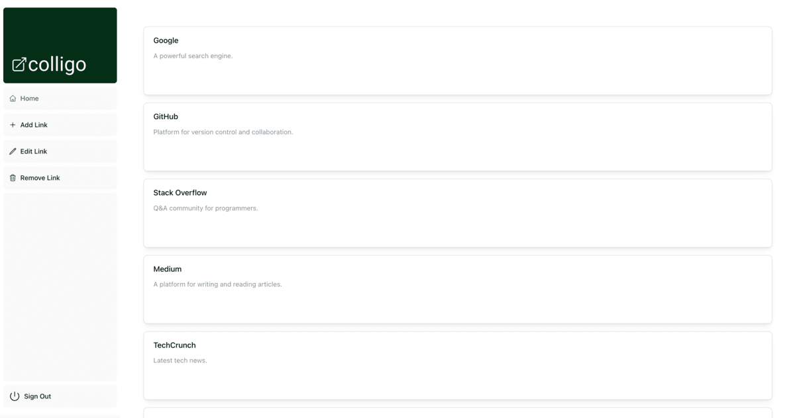

<a name="readme-top"></a>
<!-- PROJECT LOGO -->
<div align="center">
  <a href="https://github.com/danvgar/colligo">
    
  </a>
<h3 align="center">Colligo</h3>
  <p align="center">
    <a href="https://colligo.vercel.app/">Colligo</a> is a full-stack web app for filtering, organizing, and sharing your favorite bookmarks. 
    <br />
    <br />
    <a href="https://github.com/danvgar/colligo"><strong>Explore the docs »</strong></a>
    <br />
    <br />
    <a href="https://colligo.vercel.demo/">View Demo</a>
    ·
    <a href="https://github.com/danvgar/colligo/issues">Report Bug</a>
    ·
    <a href="https://github.com/danvgar/colligo/issues">Request Feature</a>
  </p>
</div>

<!-- TABLE OF CONTENTS -->
<details>
  <summary>Table of Contents</summary>
  <ol>
    <li>
      <a href="#about-the-project">About The Project</a>
      <ul>
        <li><a href="#built-with">Built With</a></li>
      </ul>
    </li>
    <li>
      <a href="#getting-started">Getting Started</a>
      <ul>
        <li><a href="#prerequisites">Prerequisites</a></li>
        <li><a href="#installation">Installation</a></li>
      </ul>
    </li>
    <li><a href="#usage">Usage</a></li>
    <li><a href="#roadmap">Roadmap</a></li>
    <li><a href="#contributing">Contributing</a></li>
    <li><a href="#license">License</a></li>
    <li><a href="#contact">Contact</a></li>
    <li><a href="#acknowledgments">Acknowledgments</a></li>
  </ol>
</details>

<!-- ABOUT THE PROJECT -->

## About The Project

<!-- [![Product Name Screen Shot][product-screenshot]](https://example.com) -->

<p align="right">(<a href="#readme-top">back to top</a>)</p>

### Built With

Colligo was built using the <a href="https://nextjs.org/">NextJS</a> framework, which includes <a href="https://react.dev/">React</a>, <a href="https://www.typescriptlang.org/">TypeScript</a>, and <a href="https://tailwindcss.com/">Tailwind</a> technologies. 

This app uses the <a href="https://mantine.dev/">Mantine UI</a> library for front-end development, as well as components from the <a href="https://nextjs.org/learn/dashboard-app">NextJS Financial Dashboard</a>.

<p align="right">(<a href="#readme-top">back to top</a>)</p>

<!-- GETTING STARTED -->

## Getting Started

This is a [Next.js](https://nextjs.org/) project bootstrapped with [`create-next-app`](https://github.com/vercel/next.js/tree/canary/packages/create-next-app). You will need to install the latest version of [Node](https://nodejs.org/en/download) before starting.

### Installation

1. Clone the repo
   ```bash
   git clone https://github.com/danvgar/colligo.git
   ```
2. Install NPM packages
   ```bash
   npm install
   ```
3. Run the development server:
   ```bash
   npm run dev
   ```
4. Open [http://localhost:3000](http://localhost:3000) with your browser to see the result.

<p align="right">(<a href="#readme-top">back to top</a>)</p>

<!-- USAGE EXAMPLES -->

## Usage

Use this space to show useful examples of how a project can be used. Additional screenshots, code examples and demos work well in this space. You may also link to more resources.

_For more examples, please refer to the [Documentation](https://example.com)_

<p align="right">(<a href="#readme-top">back to top</a>)</p>

<!-- ROADMAP -->

## Roadmap

- MVP - A full stack CRUD app that allows creating, reading, updating, and deleting a database of links.
  - ~~Read a link to the database~~
  - Add a link to the database
  - Remove a link from the database
  - Update a link from the database
- Filter by Tags
  - Available filter options reduces based on whether displayed links contain those tags.
  - Dynamic count within each tag of the number of links in filter that contain that tag.
- Sort by Tags
  - SideNav should already be sorted by number of links containing that tag.
- User voting per link (upvote, downvote)
  - Sort by votes
- Duplicate link detection
- Multiple Lists of links
- Discussion comments per link
  - Each link needs a distinct route then
- User Authentication
- Dynamic link insertion
  - Only submit a URL, OpenGraph information is automatically populated into link.
  - Auto-tagging links?
- Front-End Updates
  - Need a logo
  - Link skeletons
  - Improved SideNav
  - Add Demo GIF to README
  - Table Toggle vs Card View Toggle
- Browser Extensions for auto-adding links

See the [open issues](https://github.com/danvgar/colligo/issues) for a full list of proposed features (and known issues).

<p align="right">(<a href="#readme-top">back to top</a>)</p>

<!-- CONTRIBUTING -->

## Contributing

Contributions are what make the open source community such an amazing place to learn, inspire, and create. Any contributions you make are **greatly appreciated**.

If you have a suggestion that would make this better, please fork the repo and create a pull request. You can also simply open an issue with the tag "enhancement".
Don't forget to give the project a star! Thanks again!

1. Fork the Project
2. Create your Feature Branch (`git checkout -b feature/AmazingFeature`)
3. Commit your Changes (`git commit -m 'Add some AmazingFeature'`)
4. Push to the Branch (`git push origin feature/AmazingFeature`)
5. Open a Pull Request

<p align="right">(<a href="#readme-top">back to top</a>)</p>

<!-- LICENSE -->

## License

Distributed under the MIT License. See `LICENSE.txt` for more information.

<p align="right">(<a href="#readme-top">back to top</a>)</p>

<!-- CONTACT -->

## Contact

Daniel Garcia ([@danvgar](https://danvgar.co/))

<p align="right">(<a href="#readme-top">back to top</a>)</p>

<!-- ACKNOWLEDGMENTS

## Acknowledgments

- []()
- []()
- []() -->

<!-- <p align="right">(<a href="#readme-top">back to top</a>)</p> -->

<!-- MARKDOWN LINKS & IMAGES -->
<!-- https://www.markdownguide.org/basic-syntax/#reference-style-links -->

[contributors-shield]: https://img.shields.io/github/contributors/danvgar/colligo.svg?style=for-the-badge
[contributors-url]: https://github.com/danvgar/colligo/graphs/contributors
[forks-shield]: https://img.shields.io/github/forks/danvgar/colligo.svg?style=for-the-badge
[forks-url]: https://github.com/danvgar/colligo/network/members
[stars-shield]: https://img.shields.io/github/stars/danvgar/colligo.svg?style=for-the-badge
[stars-url]: https://github.com/danvgar/colligo/stargazers
[issues-shield]: https://img.shields.io/github/issues/danvgar/colligo.svg?style=for-the-badge
[issues-url]: https://github.com/danvgar/colligo/issues
[license-shield]: https://img.shields.io/github/license/danvgar/colligo.svg?style=for-the-badge
[license-url]: https://github.com/danvgar/colligo/blob/master/LICENSE.txt
[linkedin-shield]: https://img.shields.io/badge/-LinkedIn-black.svg?style=for-the-badge&logo=linkedin&colorB=555
[linkedin-url]: https://linkedin.com/in/danvgar
[product-screenshot]: images/screenshot.png
[Next.js]: https://img.shields.io/badge/next.js-000000?style=for-the-badge&logo=nextdotjs&logoColor=white
[Next-url]: https://nextjs.org/
[React.js]: https://img.shields.io/badge/React-20232A?style=for-the-badge&logo=react&logoColor=61DAFB
[React-url]: https://reactjs.org/
[Vue.js]: https://img.shields.io/badge/Vue.js-35495E?style=for-the-badge&logo=vuedotjs&logoColor=4FC08D
[Vue-url]: https://vuejs.org/
[Angular.io]: https://img.shields.io/badge/Angular-DD0031?style=for-the-badge&logo=angular&logoColor=white
[Angular-url]: https://angular.io/
[Svelte.dev]: https://img.shields.io/badge/Svelte-4A4A55?style=for-the-badge&logo=svelte&logoColor=FF3E00
[Svelte-url]: https://svelte.dev/
[Laravel.com]: https://img.shields.io/badge/Laravel-FF2D20?style=for-the-badge&logo=laravel&logoColor=white
[Laravel-url]: https://laravel.com
[Bootstrap.com]: https://img.shields.io/badge/Bootstrap-563D7C?style=for-the-badge&logo=bootstrap&logoColor=white
[Bootstrap-url]: https://getbootstrap.com
[JQuery.com]: https://img.shields.io/badge/jQuery-0769AD?style=for-the-badge&logo=jquery&logoColor=white
[JQuery-url]: https://jquery.com
